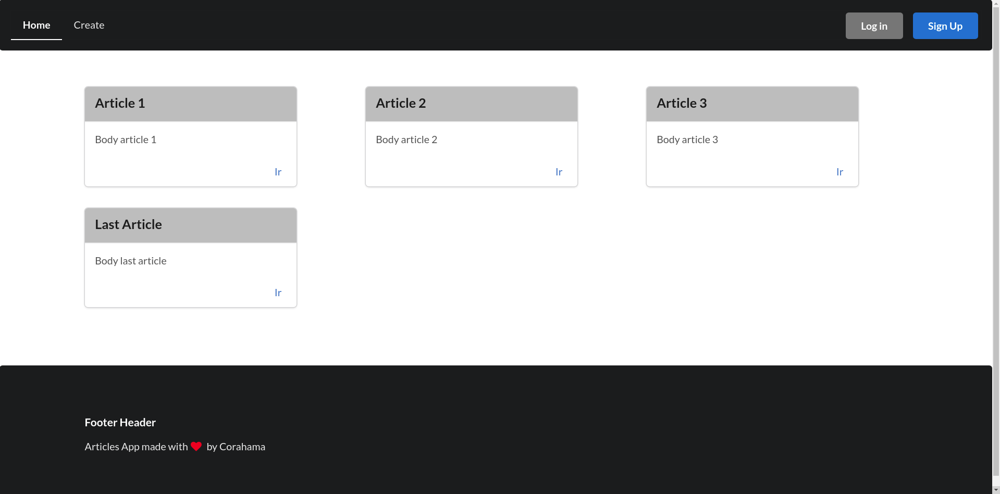

# About

This is a very simple articles web app that works with django in the back-end and react.js in the front-end.

## Goal 

The intention of this repository is to serve as a start point (maybe a boilerplate) for any developer who wants to start working with django and react. This project may serve as a reference of how to build some of the most common features in web apps.

## Features

- Bundler (webpack) configured specifically to work with this stack.
- Basic CRUD api working with Django Rest Framework.
- Register system working with redux and Django Rest Framework.
- Monolithic architecture.

---

## Notes for development

This app is configured to work with local settings in order to facilitate maintanance of applications in production, so that for development you have to add a `local_settings.py` file in the articles folder, and add into it the next lines:

    EXTRA_INSTALLED_APPS = ['corsheaders']

    EXTRA_MIDDLEWARE = ["corsheaders.middleware.CorsMiddleware"]

    CORS_ALLOWED_ORIGINS = [
        "http://localhost:3000",
    ]

Finally you just have to install the package corseheaders (the corresponding version is in the requierements.txt file)